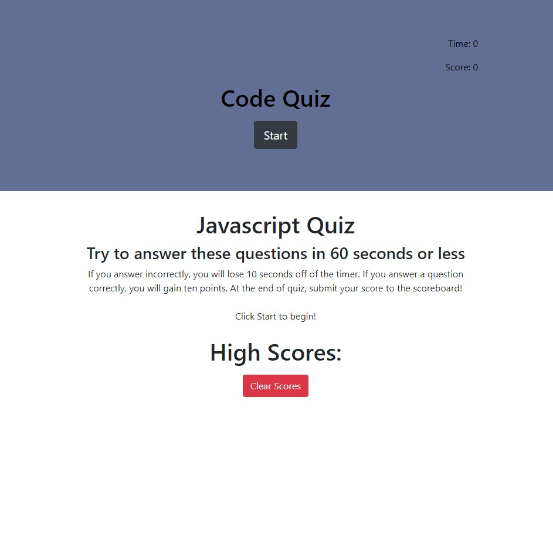
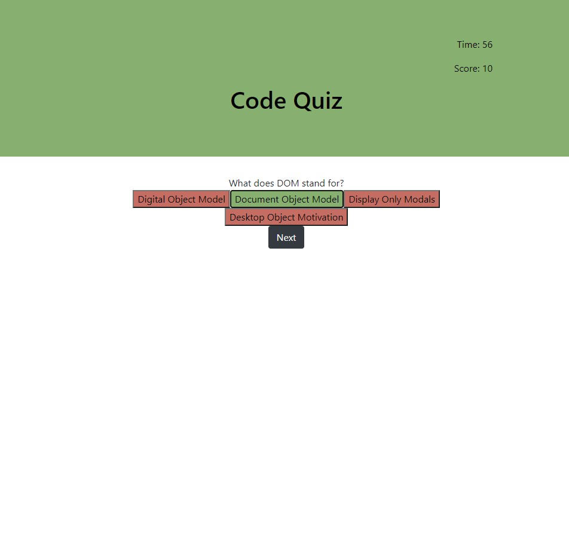
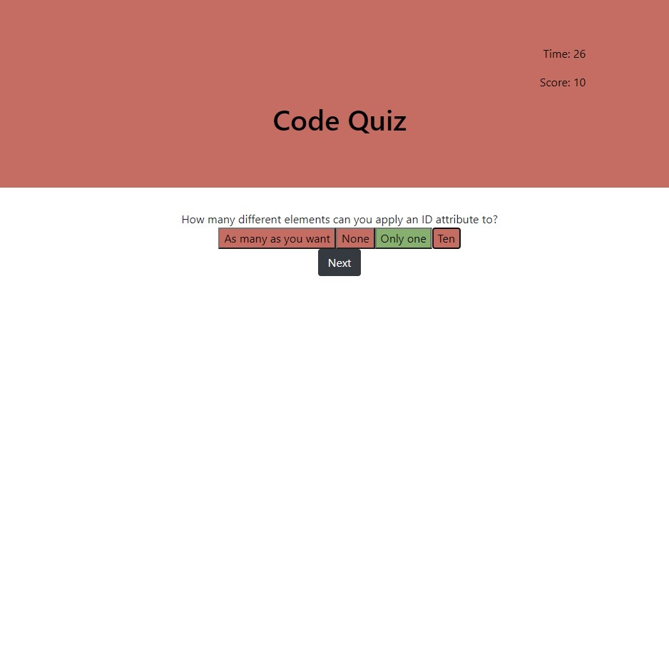
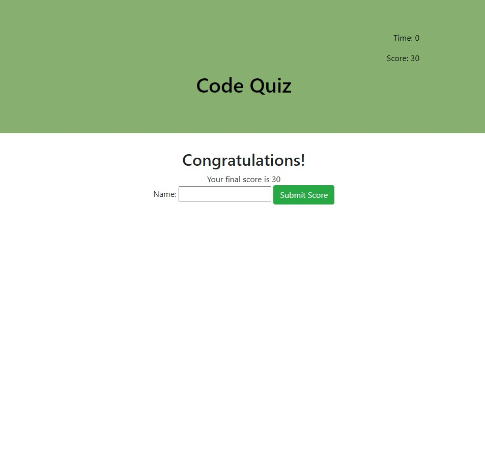
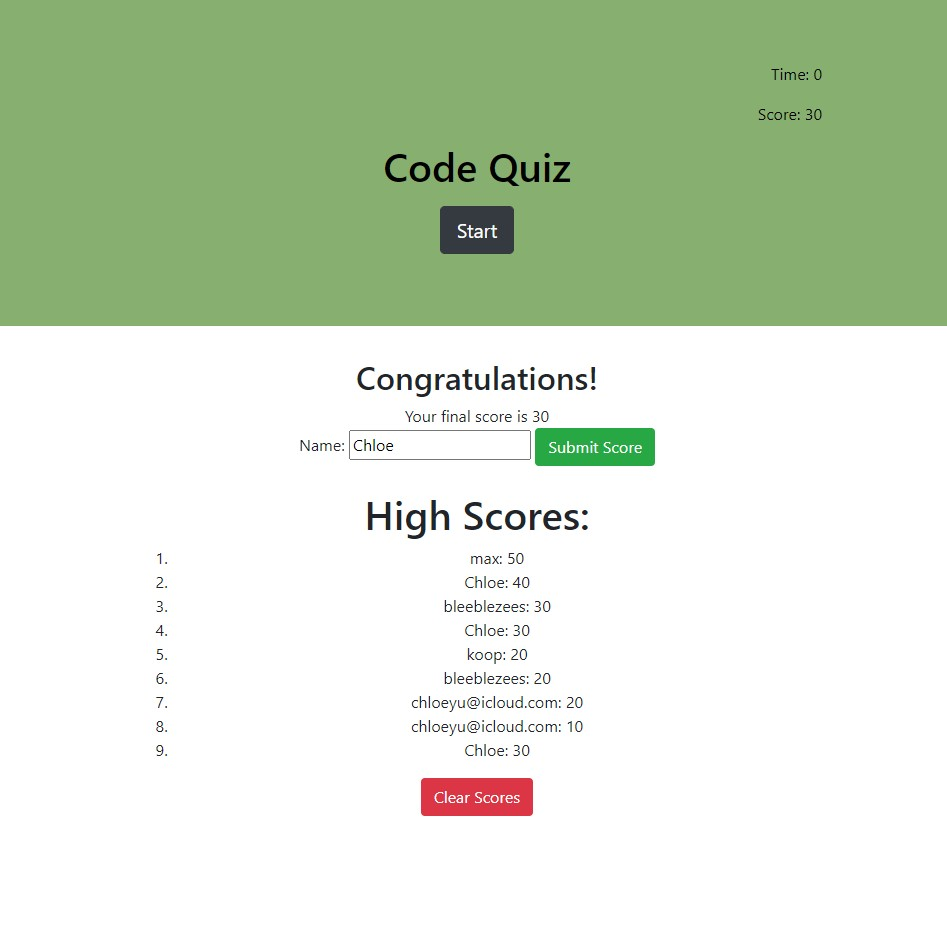

# Javascript Code Quiz

## Description
The Code Quiz is a timed coding quiz that provides the user with multiple choice questions to answer in order to test their knowledge of javascript.  This app runs in the browser and features dynamically updated HTML and CSS powered by JavaScript code.

## Technology
JavaScript is used to update the HTML page to display the questions and answer buttons.  It also updates the CSS fields upon answering a question and allows the user to submit highscores to be posted on the page.

## Motivation
One strong motivation to build this project was to create an online coding assessment similar to those offered in interviews for programming jobs.  It also was a great way to test my knowledge of javascript in creating the interactive website.

## Challenges
One challenge that I encountered was determining which parts of the page to encode into hidden sections of the HTML and which parts to create using JavaScript only.  

# Web Address
## Deployed Application:
https://chloeyu17.github.io/code-quiz

## Github Repository:
https://github.com/chloeyu17/code-quiz

# Images

